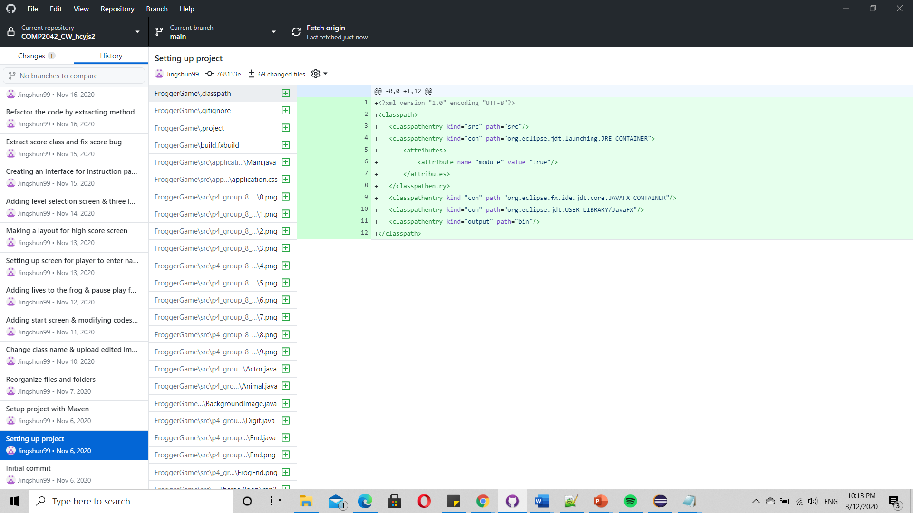
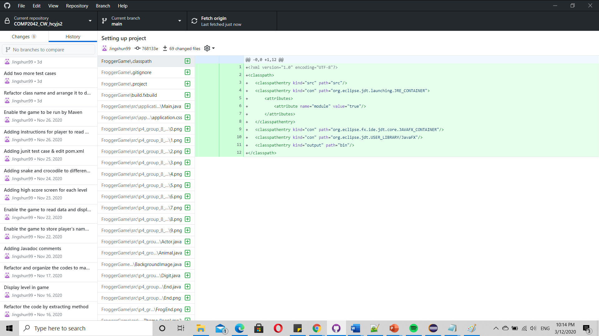
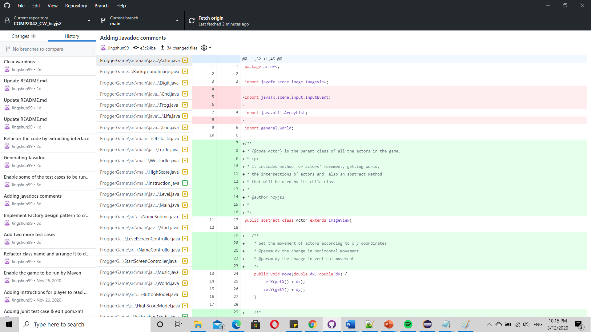

# Frogger
> Frogger is an arcade game developed by Konami and originally published by Sega. The objective of the game is to guide the frogs to their home at the top of the screen. The player has to avoid obstacles while crossing the road and get across the river with the help of turtles and logs.

## COMP2042_CW_hcyjs2
This coursework is about maintaining and extending a re-implementation of a classic retro game [Frogger](https://github.com/hirish99/Frogger-Arcade-Game) by refactoring and addition of new features.

### IDE
- Eclipse Version: 2019-12 (4.14.0)
- Java Version: 13

### Build
- Maven 

### Running application
Import this project as Existing Maven Project.

Run the following class to start the application
```
src/main/java/application/Main.java
```
Before running the application, insert the following VM argument in Run Configuration
```
--module-path "JavaFXPATH" --add-modules=ALL-MODULE-PATH
```
Maven build script
```
mvn clean test
```

## Refactoring
	1. Reorganize files and folders
	   - Split the files into different packages.
	2. Categorise resources
	   - Split resources into three different folders(Font, Image, Music).
	3. Rename class name
	   - Change Animal & MyStage class to Frog & Music class accordingly.
	4. Extract Method
	   - To avoid a single method carrying too much responsibilities, a lot of method is extracted hence improving readability and more understandable.
	5. Extract Interface
	   - ActorFactory and Model interface are created.
	6. Change method signature
	   - Encapsulate field by making it private and creating access methods(getter &setter).
	7. MVC design pattern
	   - Implement MVC design pattern for classes that responsible for displaying screen (Menu, HighScore and etc) to separate application concerns.
	8. Factory design pattern
	   -Implement Factory design pattern for the actors by creating ActorFactory interface and ActorFactoryImpl class.

## Addition
	1. Menu Screen
	   - Create a menu screen that consists of start, help and exit button.
	2. Level Selection Screen
	   - Create a level selection screen for player to select the difficulty of game.
	3. Help Screen
	   - Create a help screen to display the instructions on how to play the game.
	4. Name Submission Screen
	   - Create a screen for player to enter his name.
	5. High Score Screen
	   - Create a high score screen that displays the high score.
	6. Different levels
	   - Add three different levels in the game with increasing difficulty.
	7. Snake and Crocodile
	   - Add snake and crocodile in different level of game.
	8. Life
	   - Add lives to limit the life of frog to 3.
	9. Pause & Resume feature
	   - Player can pause the game by pressing 'P' and resume the game by pressing 'R'.
	10. High Score List
	   - Store the score of each rounds of different level in files.

## Junit
Introduce Junit test cases for the methods to ensure that the methods work and come out with an expected result. 

## Javadocs
Generate javadoc for all the classes to explain how the codes work.
	   
## Git Use
Github is used for version control in this project. Below are the Screenshots of version control history from Github desktop:








